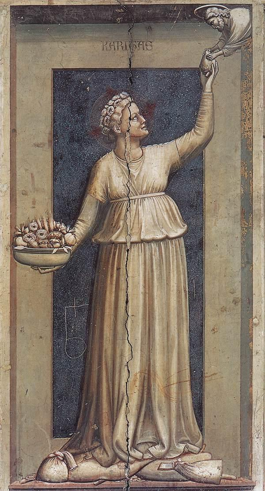

# Caridade

Autor: Giotto

{width=600}

## Passagem de Proust

    No ano em que comemos tantos aspargos, a criada de cozinha habitualmente encarregada de os “pelar” era uma pobre criatura doentia, já em adiantado estado de gravidez quando chegamos pela Páscoa, e até espantava que Françoise a deixasse andar e trabalhar tanto, pois ela começava a carregar com dificuldade adiante de si o misterioso cesto, cada dia mais cheio, de que se adivinhava a magnífica forma sob suas vastas blusas. Lembravam estas as opalandas que vestem certas figuras simbólicas de Giotto, de que o sr. Swann me dera fotografias. Fora ele mesmo quem nos fizera observar tal coisa e, sempre que pedia notícias da criada de cozinha, era com estas palavras: “E como vai a Caridade de Giotto?”. Aliás ela própria, a pobre rapariga, gorda, com a gravidez, até o rosto, até as faces que tombavam retas e quadradas, muito se assemelhava com efeito àquelas virgens, fortes e varonis, ou antes matronas, que na Arena personificam as virtudes. E reconheço agora que ainda se lhe assemelhavam de outra maneira essas Virtudes e Vícios de Pádua. Da mesma forma que a imagem daquela rapariga era acrescida pelo símbolo adicional que ela carregava adiante do ventre sem parecer compreender-lhe o sentido e sem que nada em seu rosto lhe traduzisse a beleza e o espírito, como se fora tão-somente um simples e pesado fardo, é assim, sem o suspeitar, que a possante comadre que está representada na Arena debaixo do nome de “Cantas” (e cuja reprodução se achava pendurada à parede de minha sala de estudos em Combray) encarna a referida virtude sem que nenhum pensamento de caridade haja alguma vez passado por seu rosto enérgico e vulgar. Por uma bela invenção do pintor, ela calca aos pés os tesouros da terra, mas exatamente como se pisasse uvas em um lagar, ou antes, como se tivesse subido em cima de uns sacos para elevar-se mais; e estende a Deus seu coração inflamado, digamos melhor, ela o “passa” a Ele, como uma cozinheira passa um saca-rolhas, pelo respiradouro de seu subsolo, a alguém que lho pede da janela do andar térreo. A Inveja, essa, já tinha mais expressão de inveja. Mas também nesse afresco o símbolo ocupa tanto espaço e é representado como tão real, tão grossa é a serpente que silva nos lábios da Inveja, tão completamente lhe enche a boca escancarada que os músculos de seu rosto estão distendidos pelo esforço de contê-la, como os de uma criança a soprar um balão, e a atenção da Inveja, e a nossa igualmente, concentrada de todo na ação de seus lábios, quase que não tem tempo de entregar-se a pensamentos invejosos.
    Apesar de toda a admiração do sr. Swann por essas figuras de Giotto, por muito tempo não senti nenhum prazer em contemplar em nossa sala de estudo, onde haviam pendurado as cópias que ele me trouxera, aquela Caridade sem caridade, aquela Inveja que mais parecia uma ilustração de livro de medicina para mostrar a compressão da glote ou da campainha por um tumor da língua ou pela introdução do instrumento operatório, uma Justiça cujo rosto comum e mesquinhamente regular era aquele mesmo que, em Combray, caracterizava certas boas burguesas devotas e secas que eu via na igreja e várias das quais já estavam engajadas na milícia de reserva da Injustiça. Mais tarde, porém, compreendi que a estranheza impressionante, a beleza especial daqueles afrescos, provinha do considerável lugar que ali ocupava o símbolo, e o fato de estar ele representado não como um símbolo, pois o pensamento simbolizado não se achava expresso, mas sim como real, como efetivamente sofrido ou materialmente manejado, dava à significação da obra qualquer coisa de mais literal e preciso, e a seu ensinamento qualquer coisa de mais concreto e incisivo. Com a pobre criada de cozinha, também, não era a atenção incessante atraída para seu ventre, pelo peso que o distendia? E assim também, muitas vezes o pensamento dos agonizantes é desviado para o lado efetivo, doloroso, obscuro, visceral, para esse avesso da morte que é justamente o lado que ela lhes apresenta, que lhes faz rudemente sentir e que muito mais se parece com um fardo que os esmaga, com uma dificuldade de respirar, com uma necessidade de beber, do que com aquilo a que chamamos ideia de morte.
    Aqueles Vícios e Virtudes de Pádua deviam ter mesmo muita realidade, visto que me apareciam tão vivos como a criada grávida; e ela própria não se me afigurava menos alegórica. E talvez essa não participação (pelo menos aparente) da alma de um ser na virtude que age por seu intermediário tenha também, independentemente de seu valor estético, uma realidade se não psicológica, ao menos fisiognomônica, como se diz. Quando tive mais tarde ocasião de encontrar, no curso da vida, em conventos por exemplo, encarnações verdadeiramente santas da caridade ativa, tinham geralmente um ar alegre, positivo, indiferente e brusco de cirurgião apressado, essa fisionomia em que não se lê nenhuma comiseração, nenhum enternecimento diante da dor humana, nenhum temor de feri-la, e que é a fisionomia sem doçura, a fisionomia antipática e sublime da verdadeira bondade.

## Comentário

Suas observações.