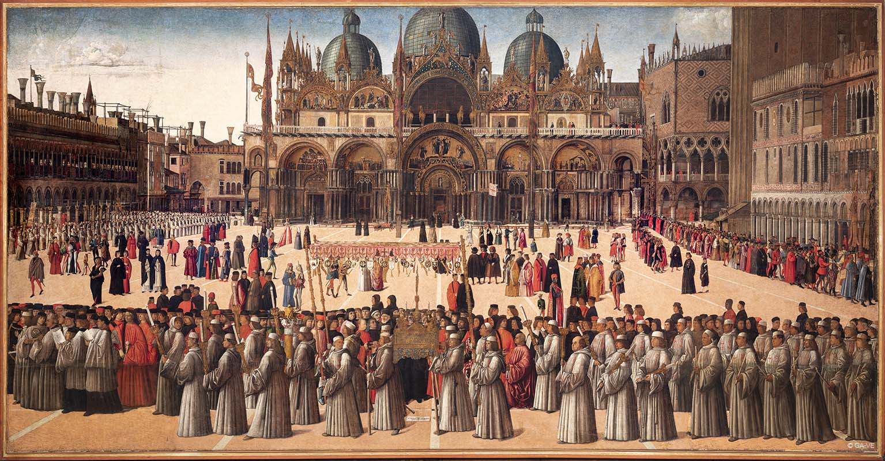

# Procissão na Praça de São Marcos

Autor: Gentile Bellini

{width=600}

::: {.obra-info}

**Data:** 1496

**Localização:** Gallerie dell'Accademia de Veneza.

**Recherche:** *No Caminho de Swann*, "Combray"

:::

## Passagem de Proust

::: {.long-quote}

Mas minha imaginação (como esses arquitetos da escola de Viollet-le-Duc, que, julgando encontrar em um coro Renascença e em um altar do século xvii vestígios de um coro romano, repõem todo o edifício no estado em que devia achar-se no século xii) não deixa de pé uma só pedra da nova construção, e abre e “restitui” a rua de Perchamps. Para essas reconstituições, ela dispõe aliás de dados mais precisos do que aqueles que têm em geral os restauradores: algumas imagens conservadas em minha memória, as últimas talvez que ainda existam atualmente e destinadas em breve a sumir-se, do que era Combray no tempo de minha infância; e como foi a própria Combray que as delineou em mim antes de desaparecer, têm toda a emoção, se é que se pode comparar um obscuro retrato a essas efígies gloriosas de que minha avó gostava de me dar reproduções, dessas gravuras antigas da Ceia ou desse quadro de Gentile Bellini, nos quais se veem, em um estado que não mais existe hoje em dia, a obra-prima de Leonardo e o pórtico de São Marcos.

— Marcel Proust, *No Caminho de Swann*, tradução de Mario Quintana.

:::

## Comentário

## Obras relacionadas

- Caridade, de Giotto
- Vista de Delft, de Vermeer

---

[← Página inicial](../index.qmd)
[Próxima obra →](32a-batismo-dos-selenitas.qmd)
