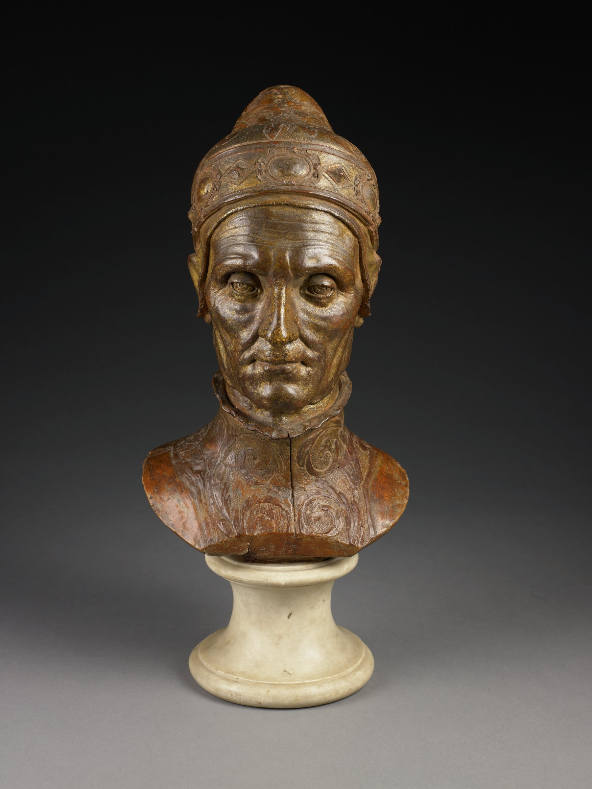

# Busto do Doge Leonardo Loredan

{width=600}

::: {.obra-info}

**Recherche:** *No Caminho de Swann*, "Combray"

:::

## Passagem de Proust

::: {.long-quote}

Swann sempre tivera o particular gosto de descobrir na pintura dos mestres não apenas os caracteres gerais da realidade que nos cerca, mas aquilo que ao contrário parece menos suscetível de generalidade, os traços individuais dos rostos que conhecemos: assim, na matéria de um busto do doge Loredano por Antonio Rizzo, a saliência dos pômulos, a obliquidade das sobrancelhas, a espantosa parecença, enfim, com o seu cocheiro Rémi; sob as cores de Ghirlandaio, o nariz do sr. Palancy; num retrato de Tintoreto, a invasão das bochechas pela implantação dos primeiros pelos das suíças, o desvio do nariz, a agudeza do olhar, a congestão das pálpebras do dr. Du Boulbon.

— Marcel Proust, *No Caminho de Swann*, tradução de Mario Quintana.

:::

## Comentário

## Obras relacionadas

- Caridade, de Giotto
- Vista de Delft, de Vermeer

---

[← Página inicial](../index.qmd)
[Próxima obra →](32a-batismo-dos-selenitas.qmd)
