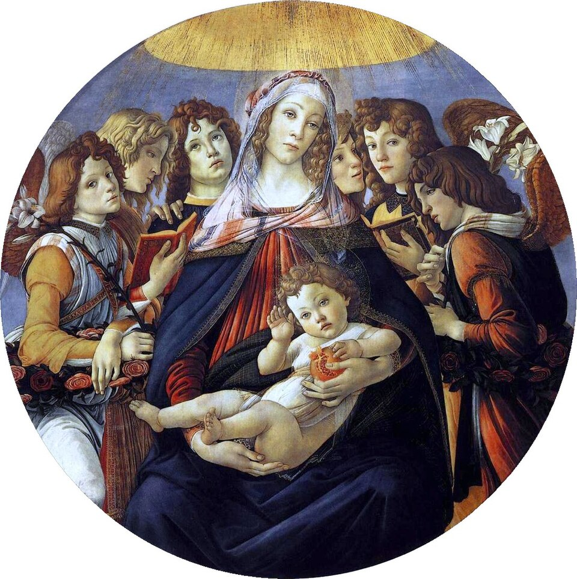

# Primavera

Autor: Sandro Botticelli

{width=600}

::: {.obra-info}

**Data:** 1487

**Recherche:** *No Caminho de Swann*, "Combray"

:::

## Passagem de Proust

::: {.long-quote}

Bem sabia Swann que Odette não se achava tão enamorada para que sentisse tamanho pesar por tal coisa, mas como ela era boa e gostava de lhe ser agradável e muitas vezes se entristecia quando lhe causava uma contrariedade, achou muito natural que agora também se entristecesse por havê-lo privado daquele prazer de passarem uma hora juntos, prazer que era tão grande, não para ela, mas para ele. Era no entanto uma coisa tão sem importância que Swann acabou por espantar-se com o ar doloroso de Odette. Lembrava-lhe assim, mais do que habitualmente, as mulheres do pintor da Primavera. Tinha em tal momento aquela mesma face abatida e dolorosa, como que sucumbindo ao peso de uma dor muito intensa para elas, simplesmente porque deixam o Menino Jesus brincar com uma romã ou veem Moisés deitar água numa tina.

— Marcel Proust, *No Caminho de Swann*, tradução de Mario Quintana.

:::

## Passagem de Proust

::: {.long-quote}

A dois passos dali, um rapagão de libré sonhava, imóvel, escultural, inútil, como esse guerreiro puramente decorativo que se vê nos quadros mais tumultuosos de Mantegna, a cismar, apoiado no escudo, enquanto todos se arremessam e trucidam a seu lado; destacado do grupo de seus camaradas, que se apressuravam em torno de Swann, parecia tão decidido a desinteressar-se daquela cena, que vagamente seguia com os seus olhos glaucos e cruéis, como se fosse a matança dos Inocentes ou o martírio de são Tiago. Parecia precisamente pertencer a essa raça extinta — ou que talvez só tenha existido no retábulo de San Zeno e nos afrescos dos Eremitani onde Swann a conhecera e onde ela ainda sonha — oriunda do conúbio de uma estátua antiga com algum modelo paduano do Mestre ou algum saxão de Albert Durer.

— Marcel Proust, *No Caminho de Swann*, tradução de Mario Quintana.

:::

## Comentário

## Obras relacionadas

- Caridade, de Giotto
- Vista de Delft, de Vermeer

---

[← Página inicial](../index.qmd)

