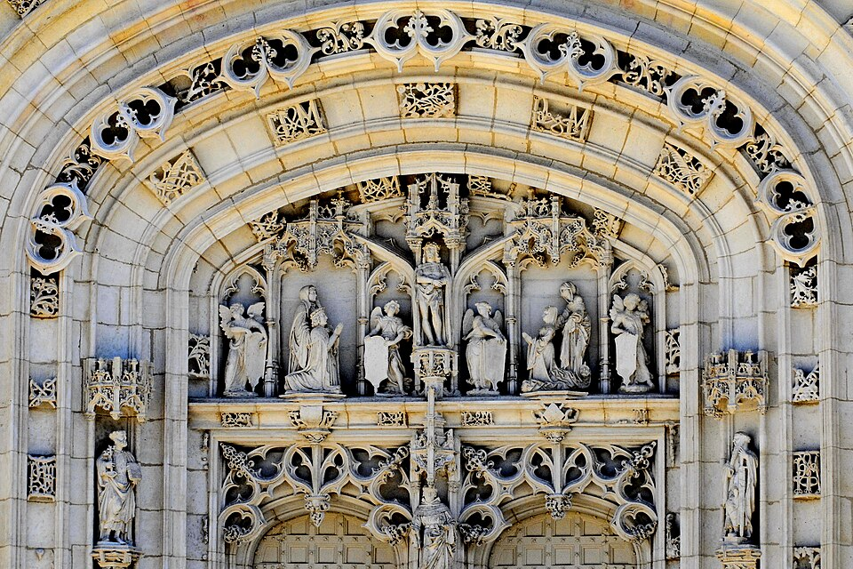

# Tímpano do Monastério Real de Brou

{width=600}

::: {.obra-info}

**Data:** 1506-1532

**Recherche:** *No Caminho de Swann*, "Combray"

:::

## Passagem de Proust

::: {.long-quote}

Mas sempre o pensamento da ausente se achava indissoluvelmente ligado aos atos mais simples da vida de Swann — almoçar, receber a correspondência, sair, deitar-se — pela própria tristeza que sentia em os cumprir sem ela, como essas iniciais de Felisberto, o Formoso, que Margarida da Áustria mandou entrelaçar às suas por toda parte na igreja de Brou, por causa do pesar que por ele sofria.

— Marcel Proust, *No Caminho de Swann*, tradução de Mario Quintana.

:::

## Comentário

## Obras relacionadas

- Caridade, de Giotto
- Vista de Delft, de Vermeer

---

[← Página inicial](../index.qmd)

