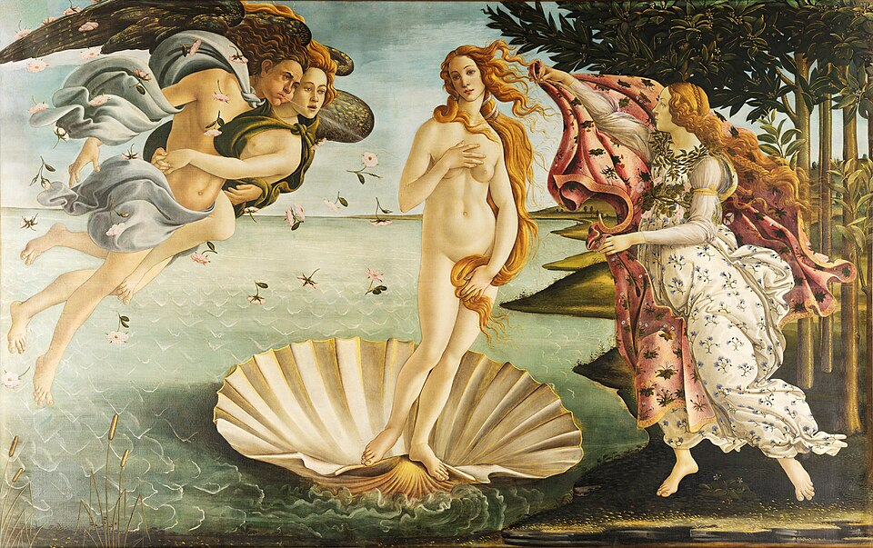

# O Nascimento de Vênus

Autor: Sandro Botticelli

{width=600}

::: {.obra-info}

**Data:** 1482—86

**Recherche:** *No Caminho de Swann*, "Combray"

:::

## Passagem de Proust

::: {.long-quote}

Julgou até compreender, certa vez, que essa leviandade de costumes que não suspeitara em Odette era bastante conhecida, e que em Bade e em Nice, quando ali costumava passar vários meses, ela adquirira uma espécie de notoriedade galante. Procurou aproximar-se de certos farristas, para interrogá-los; mas estes sabiam que ele conhecia Odette; e depois, tinha medo de os fazer pensar de novo nela, de os pôr no seu encalço. Mas ele, a quem até então nada pareceria tão fastidioso como tudo quanto se referisse à vida cosmopolita de Bade ou de Nice, ao saber que Odette levara uma vida livre nessas cidades de prazer, sem que devesse jamais descobrir se era unicamente para atender a necessidades de dinheiro que, graças a ele, ela não mais sofria, ou devido a caprichos que podiam renovar-se, inclinava-se agora com uma angústia impotente, cega e vertiginosa para o abismo sem fundo onde se haviam sumido aqueles anos do princípio do Septenato, durante os quais se passava o inverno no Passeio dos Ingleses, o verão sob as tílias de Bade, e achava-lhes uma dolorosa mas esplêndida profundeza como a que lhes teria emprestado um poeta; e ter-se-ia aplicado em reconstituir os pequenos fatos da crônica da Côte d’Azur de então, se pudesse ajudá-lo a compreender alguma coisa do sorriso ou dos olhares — no entanto tão honestos e tão simples — de Odette, com mais paixão do que o esteta que interroga os documentos subsistentes da Florença do século xv, a ver se penetra mais avante na alma da Primavera, da Bella Vanna, ou da Vênus, de Botticelli.

— Marcel Proust, *No Caminho de Swann*, tradução de Mario Quintana.

:::

## Comentário

## Obras relacionadas

- Caridade, de Giotto
- Vista de Delft, de Vermeer

---

[← Página inicial](../index.qmd)

