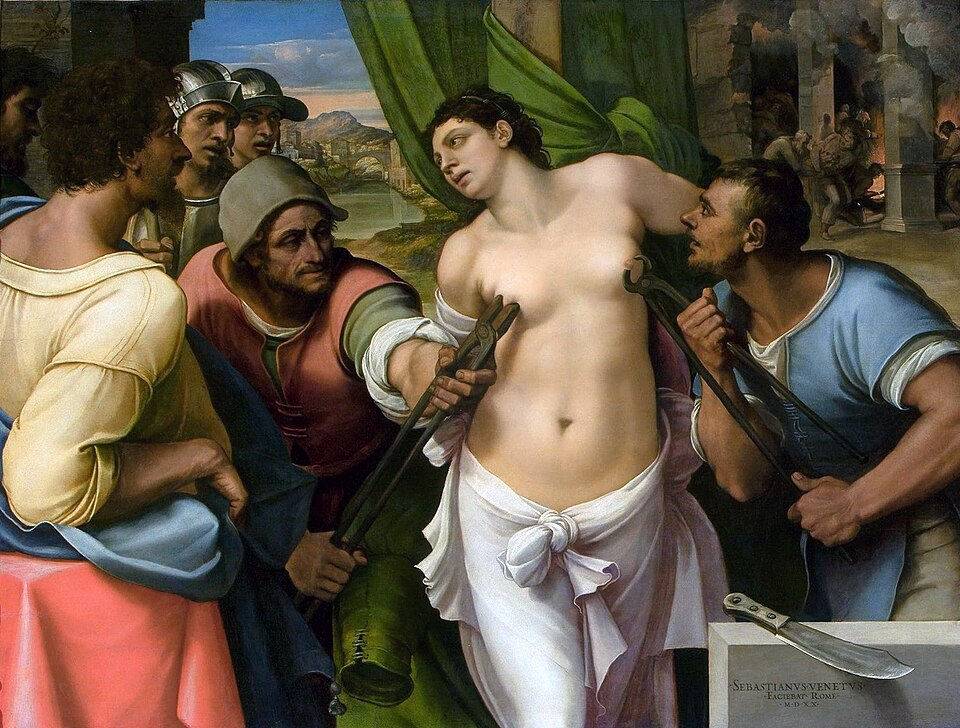

# Martírio de Santa Águeda

Autor: Sebastiano del Piombo

{width=600}

::: {.obra-info}

**Data:** 1520

**Recherche:** *No Caminho de Swann*, "Combray"

:::

## Passagem de Proust

::: {.long-quote}

Um deles, de aspecto particularmente feroz, e assaz semelhante ao executor em certos quadros da Renascença que representam suplícios, avançou para ele com um ar implacável, para lhe apanhar os pertences. Mas a dureza de seu olhar de aço era compensada pela suavidade de suas luvas de algodão, de modo que, ao aproximar-se de Swann, parecia testemunhar desprezo por sua pessoa e consideração para com seu chapéu. Tomou-o com um cuidado a que a exatidão do movimento emprestava algo de meticuloso e uma delicadeza que tornava quase tocante a aparelhagem da sua força. Passou-o depois a um de seus auxiliares, novo e tímido, que expressava o seu terror revirando em todos os sentidos uns olhos selvagens e mostrava a agitação de um animal cativo nas primeiras horas de sua domesticidade.

— Marcel Proust, *No Caminho de Swann*, tradução de Mario Quintana.

:::

## Comentário

## Obras relacionadas

- Caridade, de Giotto
- Vista de Delft, de Vermeer

---

[← Página inicial](../index.qmd)

