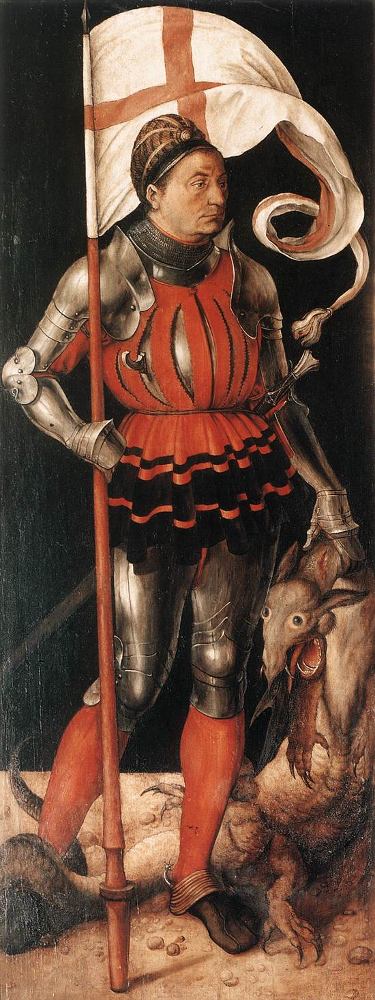

# São Jorge (detalhe do retábulo de Paumgartner)

Autor: Albrecht Dürer

{width=600}

::: {.obra-info}

**Data:** 1503

**Recherche:** *No Caminho de Swann*, "Combray"

:::

## Passagem de Proust

::: {.long-quote}

A dois passos dali, um rapagão de libré sonhava, imóvel, escultural, inútil, como esse guerreiro puramente decorativo que se vê nos quadros mais tumultuosos de Mantegna, a cismar, apoiado no escudo, enquanto todos se arremessam e trucidam a seu lado; destacado do grupo de seus camaradas, que se apressuravam em torno de Swann, parecia tão decidido a desinteressar-se daquela cena, que vagamente seguia com os seus olhos glaucos e cruéis, como se fosse a matança dos Inocentes ou o martírio de são Tiago. Parecia precisamente pertencer a essa raça extinta — ou que talvez só tenha existido no retábulo de San Zeno e nos afrescos dos Eremitani onde Swann a conhecera e onde ela ainda sonha — oriunda do conúbio de uma estátua antiga com algum modelo paduano do Mestre ou algum saxão de Albert Durer.

— Marcel Proust, *No Caminho de Swann*, tradução de Mario Quintana.

:::

## Comentário

## Obras relacionadas

- Caridade, de Giotto
- Vista de Delft, de Vermeer

---

[← Página inicial](../index.qmd)

