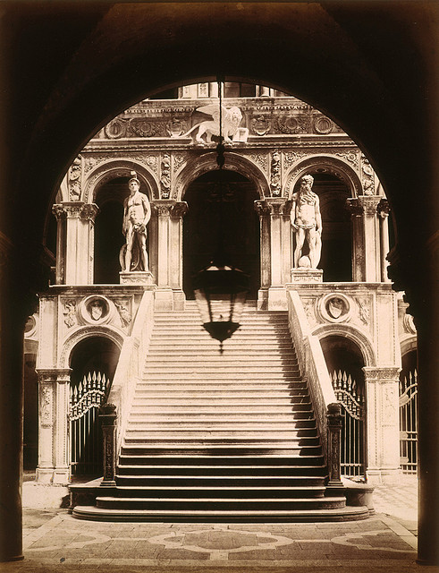

# Escadaria dos Gigantes no Palácio Ducal de Veneza

{width=600}

::: {.obra-info}

**Data:** 1896 (ano da fotografia)

**Recherche:** *No Caminho de Swann*, "Combray"

:::

## Passagem de Proust

::: {.long-quote}

Outros ainda, colossais também, postavam-se nos degraus de uma escadaria monumental a que a sua presença decorativa e imobilidade marmórea poderiam dar o nome, como a do palácio ducal, de “Escadaria dos Gigantes”, e que Swann subiu com o triste pensamento de que Odette jamais a havia pisado.

— Marcel Proust, *No Caminho de Swann*, tradução de Mario Quintana.

:::

## Comentário

## Obras relacionadas

- Caridade, de Giotto
- Vista de Delft, de Vermeer

---

[← Página inicial](../index.qmd)

