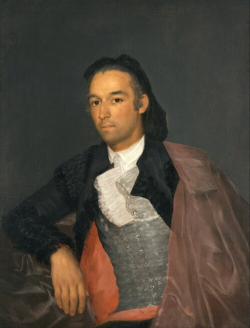

# O matador Pedro Romero

Autor: Francisco de Goya

{width=600}

::: {.obra-info}

**Data:** 1795-98

**Recherche:** *No Caminho de Swann*, "Combray"

:::

## Passagem de Proust

::: {.long-quote}

Chegado ao alto da escada, ao longo da qual o seguira um criado de face lívida, com uma trancinha amarrada com uma fita, como um sacristão de Goya ou um tabelião do repertório, Swann passou por um bureau onde lacaios, sentados como notários diante de grandes registros, se ergueram e inscreveram o seu nome. Atravessou então um pequeno vestíbulo que — como certas peças arranjadas pelo proprietário de modo a servirem de abrigo a uma única obra de arte, da qual tomam a denominação, e que nada mais contêm, na sua propositada nudez — exibia à entrada, como uma preciosa efígie de Benvenuto Cellini representando um atalaia, um jovem lacaio com o corpo ligeiramente curvado para diante, a alçar por cima de sua alta gola vermelha um rosto ainda mais vermelho, de onde escapavam torrentes de ardor, de timidez e de zelo, e que, varando com o seu olhar impetuoso, vigilante e frenético as tapeçarias de Aubusson que pendiam à porta do salão de música, parecia espiar, com uma impassibilidade militar ou uma fé sobrenatural — alegoria do alarma, encarnação da expectativa, monumento da prontidão —, anjo ou vigia, de uma torre de fortaleza ou de catedral, a aparição do inimigo ou a hora do Juízo. Não restava mais a Swann senão entrar na sala do concerto, cujas portas lhe abriu um lacaio carregado de correntes, inclinando-se como se lhe entregasse as chaves de uma cidade. Mas Swann pensava na casa onde poderia achar-se naquele mesmo instante, se Odette o tivesse permitido, e a entrevista lembrança de um jarro de leite vazio sobre um capacho apertou-lhe o coração.

— Marcel Proust, *No Caminho de Swann*, tradução de Mario Quintana.

:::

## Comentário

## Obras relacionadas

- Caridade, de Giotto
- Vista de Delft, de Vermeer

---

[← Página inicial](../index.qmd)

