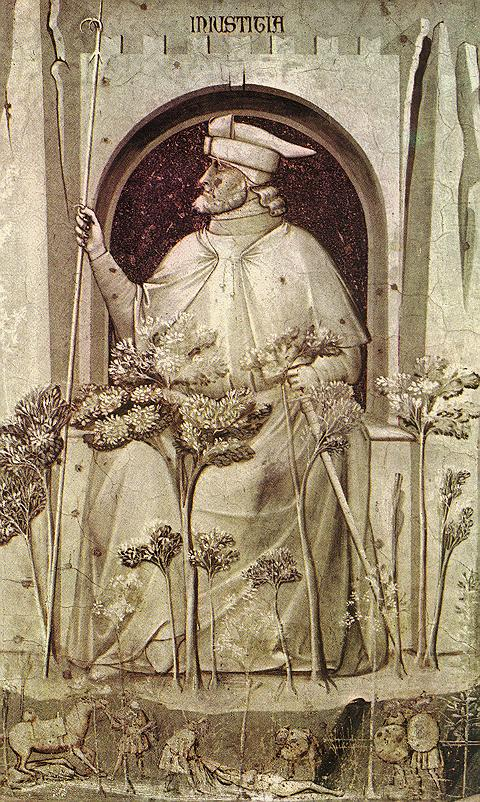

# Injustiça

Autor: Giotto

{width=600}

::: {.obra-info}

**Data:** 1304-6

**Recherche:** *No Caminho de Swann*, "Combray"

:::

## Passagem de Proust

::: {.long-quote}

O monóculo do marquês de Forestelle era minúsculo, não tinha aro e, obrigando a uma crispação incessante e dolorosa o olho onde se incrustava como uma cartilagem supérflua cuja presença é inexplicável e a matéria rara, dava ao rosto do marquês uma delicadeza melancólica e fazia com que as mulheres o julgassem capaz de grandes penas de amor. Mas o do sr. de Saint-Candé, cercado de um gigantesco anel, como Saturno, era o centro de gravidade de um rosto que se ordenava a todo instante em relação a ele, cujo nariz fremente e rubro e o lábio carnudo e sarcástico procuravam, com os seus trejeitos, pôr-se à altura dos mutáveis reflexos de espírito com que fulgurava o disco de vidro, e era preferido aos mais belos olhares do mundo por mulheres esnobes e depravadas, a quem fazia sonhar com encantos artificiais e refinadas volúpias; enquanto, atrás do seu monóculo, o sr. de Palancy que, com a sua grossa cabeça de carpa, de olhos redondos, se deslocava lentamente no meio da festa, descerrando de instante a instante as mandíbulas como para procurar orientação, tinha o ar de apenas transportar consigo um fragmento acidental, e talvez puramente simbólico, do vidro do seu aquário, parte destinada a figurar o todo, que lembrou a Swann, grande admirador dos Vícios e das Virtudes de Giotto em Pádua, aquele Injusto ao lado do qual um ramo folhudo evoca as florestas onde se oculta o seu covil.

— Marcel Proust, *No Caminho de Swann*, tradução de Mario Quintana.

:::

## Comentário

## Obras relacionadas

- Caridade, de Giotto
- Vista de Delft, de Vermeer

---

[← Página inicial](../index.qmd)

