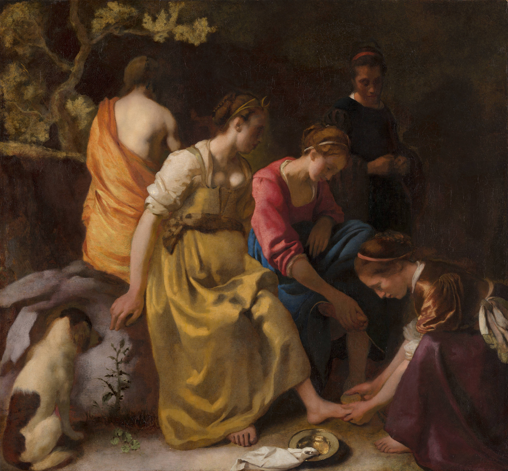

# Diana e suas companheiras

Autor: Jan Vermeer

{width=600}

::: {.obra-info}

**Data:** 1653—54

**Recherche:** *No Caminho de Swann*, "Combray"

:::

## Passagem de Proust

::: {.long-quote}

Muitas vezes pensara nisso. Agora que reencetara o seu ensaio sobre Vermeer, teria necessidade de voltar pelo menos alguns dias a Haia, a Dresden, a Brunswick. Estava persuadido de que uma “Toalete de Diana” comprada pela Mauritshuis na venda Goldschmidt como um Nicolau Maes era na realidade de Vermeer. E desejaria estudar o quadro no local para reforçar sua convicção.

— Marcel Proust, *No Caminho de Swann*, tradução de Mario Quintana.

:::

## Comentário

## Obras relacionadas

- Caridade, de Giotto
- Vista de Delft, de Vermeer

---

[← Página inicial](../index.qmd)

