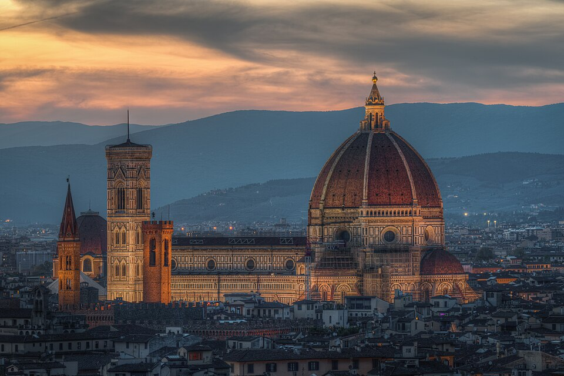

# Catedral Santa Maria das Flores (Duomo di Firenze)

{width=600}

::: {.obra-info}

**Data:** 1296-1436

**Recherche:** *No Caminho de Swann*, "Combray"

:::

## Passagem de Proust

::: {.long-quote}

Depois acontecia que uma simples variação atmosférica rica bastasse para provocar em mim essa modulação sem que houvesse necessidade de aguardar o retorno de uma estação do ano. Pois muitas vezes encontramos perdido em uma delas um dia de outra estação, à qual nos transporta e cujos prazeres particulares nos evoca e faz desejar, e nos vem interromper os sonhos que formávamos, colocando, aquém ou além do seu lugar, no calendário interpolado da Felicidade, essa folha arrancada de um outro capítulo. Mas em breve, como esses fenômenos naturais de que só podemos tirar um proveito acidental e assaz minguado para a nossa saúde ou conforto até o dia em que a ciência deles se apodera e, produzindo-os à vontade, coloca em nossas mãos a possibilidade do seu aparecimento, enfim subtraído à tutela e capricho do acaso, assim a produção daqueles sonhos de Atlântico e de Itália deixou de estar unicamente submetida às mudanças das estações e do tempo. Para fazê-los renascer, bastava-me pronunciar estes nomes: Balbec, Veneza, Florença, no interior dos quais acabara por se acumular o desejo que me haviam inspirado os lugares que eles designavam. Mesmo na primavera, encontrar nalgum livro o nome de Balbec era o suficiente para me despertar o desejo das tempestades e do gótico normando; mesmo num dia de tempestade, o nome de Florença ou de Veneza me dava o desejo do sol, dos lírios, do palácio dos Doges e de Santa Maria das Flores.

— Marcel Proust, *No Caminho de Swann*, tradução de Mario Quintana.

:::

## Comentário

## Obras relacionadas

- Caridade, de Giotto
- Vista de Delft, de Vermeer

---

[← Página inicial](../index.qmd)

