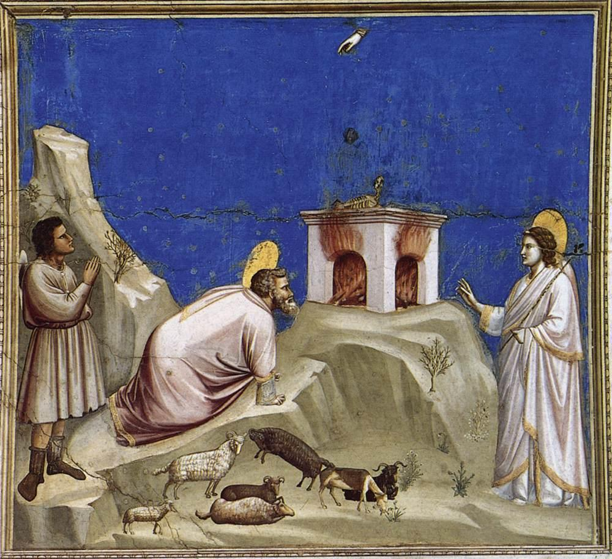

# O Sacrifício de Joaquim

Autor: Giotto

{width=600}

::: {.obra-info}

**Data:** 1304—6

**Recherche:** *No Caminho de Swann*, "Combray"

:::

## Passagem de Proust

::: {.long-quote}

Quando meu pai resolveu, um ano, que fôssemos passar as férias da Páscoa em Florença e em Veneza, não tendo como fazer entrar no nome de Florença os elementos que habitualmente compõem as cidades, fui obrigado a tirar uma cidade sobrenatural da fecundação, por certos aromas primaveris, do que eu supunha constituir, em essência, o gênio de Giotto. Em suma — e visto que não se pode fazer com que caiba em um nome muito mais duração que espaço —, como em certos quadros de Giotto que apresentam em dois momentos diversos da ação uma mesma personagem, aqui deitada no leito, ali preparando-se para montar a cavalo, o nome de Florença achava-se dividido em dois compartimentos.

— Marcel Proust, *No Caminho de Swann*, tradução de Mario Quintana.

:::

## Comentário

## Obras relacionadas

- Caridade, de Giotto
- Vista de Delft, de Vermeer

---

[← Página inicial](../index.qmd)

