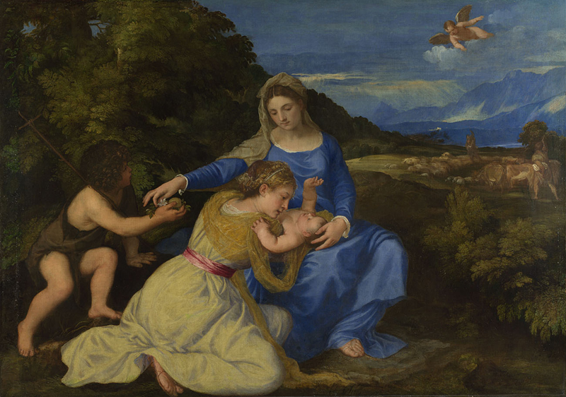

# Madonna Aldobrandini

Autor: Ticiano

{width=600}

::: {.obra-info}

**Data:** 1532

**Recherche:** *No Caminho de Swann*, "Combray"

:::

## Passagem de Proust

::: {.long-quote}

O que me comovia era pensar que aquela Florença que eu via próxima mas inacessível, em minha imaginação, se o trajeto que a separava de mim, em mim mesmo, não era viável, eu poderia atingi-la por um atalho, por um desvio, tomando o “caminho de terra”. Por certo, quando me repetia, dando assim tanto valor ao que ia ver, que Veneza era “a escola de Giorgione, a morada de Ticiano, o mais completo museu de arquitetura doméstica da Idade Média”, sentia-me feliz. Era-o no entanto ainda mais quando, saindo para uma caminhada, e andando depressa por causa do tempo que, depois de alguns dias de primavera, se tornara de novo um tempo de inverno (como o que encontrávamos habitualmente em Combray na Semana Santa) — ao ver nos bulevares os castanheiros que, mergulhados num ar glacial e líquido como água, nem por isso deixavam, convidados pontuais, já preparados, a quem nada desanima, de ir arredondando e cinzelando em seus blocos congelados a irresistível verdura cujo progressivo ímpeto o poder abortivo do frio contrariava mas não conseguia refrear —, eu pensava que já a Ponte Vecchio estava juncada de jacintos e anêmonas e que o sol da primavera já tingia as ondas do Grande Canal de um azul tão sombrio e tão nobres esmeraldas que, vindo quebrar-se ao pé das pinturas de Ticiano, podiam com elas rivalizar em riqueza de colorido. Não mais pude conter a alegria quando meu pai, consultando o barômetro e deplorando o frio, começou a procurar quais seriam os melhores trens, e quando compreendi que, penetrando após o almoço no laboratório fumoso, na sala mágica que se encarregava de operar a transmutação em redor de si, poderia a gente acordar no dia seguinte na cidade de mármore e ouro “recamada de jaspe e calçada de esmeraldas”.

— Marcel Proust, *No Caminho de Swann*, tradução de Mario Quintana.

:::

## Comentário

## Obras relacionadas

- Caridade, de Giotto
- Vista de Delft, de Vermeer

---

[← Página inicial](../index.qmd)

