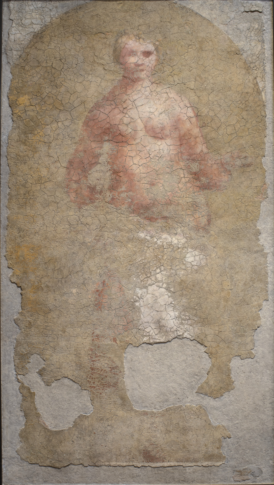

# La Nuda

Autor: Giorgione

{width=600}

::: {.obra-info}

**Data:** 1508

**Recherche:** *No Caminho de Swann*, "Combray"

:::

## Passagem de Proust

::: {.long-quote}

Mas ainda me achava a caminho do auge da alegria; atingi-o afinal (pois só nesse momento tive a revelação de que, pelas ruas marulhosas, avermelhadas pelo reflexo dos afrescos de Giorgione, não eram, como eu continuara a imaginar apesar de tantas advertências, os homens majestosos e terríveis como o mar, trazendo, sob as dobras do manto sangrento, a sua armadura de reflexos de bronze” que passeariam em Veneza na semana próxima, às vésperas da Páscoa, mas de que poderia ser eu a minúscula personagem que, numa grande reprodução de São Marcos que me haviam emprestado, o ilustrador representara de chapéu-coco, diante dos pórticos), quando ouvi meu pai dizer-me: “Ainda deve fazer frio no Grande Canal; farias bem em pôr na mala, para o que der e vier, o teu sobretudo e o teu casaco grosso”.

— Marcel Proust, *No Caminho de Swann*, tradução de Mario Quintana.

:::

## Comentário

## Obras relacionadas

- Caridade, de Giotto
- Vista de Delft, de Vermeer

---

[← Página inicial](../index.qmd)

