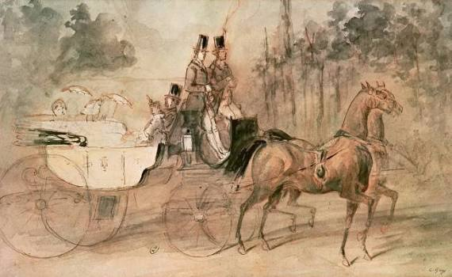

# Passeio no Bosque

Autor: Constantin Guys

{width=600}

::: {.obra-info}

**Data:** 1860

**Recherche:** *No Caminho de Swann*, "Combray"

:::

## Passagem de Proust

::: {.long-quote}

Na ordem dos méritos estéticos e das grandezas mundanas, dava eu o primeiro lugar à simplicidade quando avistava a sra. Swann a pé, com uma polonesa de lã, um gorro adornado de uma asa de lofóforo, um ramo de violeta no seio, atravessando apressada a alameda das Acácias, como se fosse apenas o caminho mais curto para regressar a casa, respondendo com um olhar aos senhores de carruagem que, ao reconhecer de longe o seu vulto, a saudavam, dizendo que ninguém era tão chique. Mas, em vez da simplicidade, era o fausto que eu colocava no lugar mais alto, se, depois de forçar Françoise, que não podia mais e se queixava de que suas pernas “entravam para dentro”, a andar de um lado para outro durante uma hora, afinal avistava, emergindo da alameda que vem da ponte Dauphine — imagem para mim de um prestígio real, de uma chegada de rainha, como nenhuma rainha de verdade me deu depois a impressão, porque eu tinha de seu poder uma imagem menos vaga e mais experimental — arrebatada pelo voo de dois fogosos cavalos, delgados e de um acentuado perfil como os que se veem nos desenhos de Constantin Guys, e levando à boleia um enorme cocheiro abrigado como um cossaco, ao lado de um minúsculo groom que lembrava o “tigre” do “falecido Baudenord”, eu avistava — ou antes, sentia sua forma imprimir-se em meu coração numa incisiva e esgotante ferida — uma incomparável vitória, propositadamente um pouco alta e deixando transparecer as formas antigas através do seu luxo dernier cri, em cujo fundo reclinava-se languidamente a sra. Swann, os cabelos agora loiros com uma única mecha cinzenta, cingidos de uma fina guirlanda de flores, de onde pendiam longos véus, na mão uma sombrinha malva, nos lábios um sorriso ambíguo em que eu não via mais que a benevolência de uma Majestade e em que sobretudo havia a provocação da cocote e que ela inclinava docemente para as pessoas que a saudavam. Aquele sorriso, na realidade, dizia a uns: “Bem me lembro, foi delicioso!”; “Eu teria gostado… foi má sorte!”; a outros: “Como queira! Vou seguir por um momento a fila e, logo que puder, cortarei”.

— Marcel Proust, *No Caminho de Swann*, tradução de Mario Quintana.

:::

## Passagem de Proust

::: {.long-quote}

A dois passos dali, um rapagão de libré sonhava, imóvel, escultural, inútil, como esse guerreiro puramente decorativo que se vê nos quadros mais tumultuosos de Mantegna, a cismar, apoiado no escudo, enquanto todos se arremessam e trucidam a seu lado; destacado do grupo de seus camaradas, que se apressuravam em torno de Swann, parecia tão decidido a desinteressar-se daquela cena, que vagamente seguia com os seus olhos glaucos e cruéis, como se fosse a matança dos Inocentes ou o martírio de são Tiago. Parecia precisamente pertencer a essa raça extinta — ou que talvez só tenha existido no retábulo de San Zeno e nos afrescos dos Eremitani onde Swann a conhecera e onde ela ainda sonha — oriunda do conúbio de uma estátua antiga com algum modelo paduano do Mestre ou algum saxão de Albert Durer.

— Marcel Proust, *No Caminho de Swann*, tradução de Mario Quintana.

:::

## Comentário

## Obras relacionadas

- Caridade, de Giotto
- Vista de Delft, de Vermeer

---

[← Página inicial](../index.qmd)

